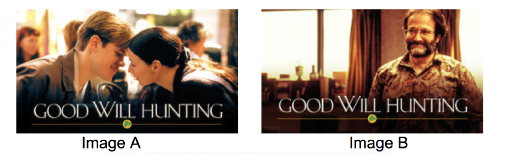

# Introduction    

Netflix is a pioneering media streaming service. It contains thousands of movies and tv series from all over the globe. There are over 100M+ active members in over 190 countries. One of the differentiating features of Netflix from its competitors is it’s recommender algorithm. Netflix provides its customers with personalized suggestions to minimize the amount of time and frustration to find content to watch. Netflix utilizes the data about what their members watch and rate along with how they interact with their platform. As a company, they do not base their recommendation solely on historical data, they “innovate using machine learning in many areas where we research, design, implement, evaluate, and productionize models and algorithms through both offline experiments and online A/B testing.”

# Scenario Design for Netflix:    
**Who are your target users?**   
The target users for Netflix are people (paying customers) seeking quality movies and tv shows in an online environment. This encompasses a global audience of millions of people from different cultures and backgrounds. Increasingly, the target user profile also includes customers seeking Netflix exclusive content.

**What are their key goals?**  
Utilize machine learning to find entertaining content that interests their members quickly. The recommender system also needs to take human desires and moods into consideration, while presenting the optimal media for their customers. 

**How can you help them accomplish their goals?**    
Provide great recommendations on tv shows or movies to watch based on their likes and dislikes.  The best recommendations should appear first, so users don’t have to dive through tons of content. Also, provide a fast high quality platform that makes content easy to find and easy to stream.

# Scenario Design for Customers:  
**Target User:**  
Global audience looking for entertaining movies, tv shows, documentaries.

**Key Goals:**  
The primary goal for the customer is to quickly find media, according to mood. 

**How to Help?:**   
Allow customers to create their own categories and still give the customer the ability to add movies to their custom category list. Let the customer be able to further customize beyond the generic Netflix “My List”. 

# Reverse Engineer Site  
Netflix does a ton of work using recommender systems and has large teams supporting them.  Having a good recommender system that performs well and keeps customers happy is essentially their product that they sell.  There are many competitors that people can use to stream content but people use Netflix because they can find good content they like quickly.  
Two examples of how they use recommender systems include their homepage layout and visualization personalizations from user to user.

## Homepage Layout  
When a user logs into Netflix the homepage layout consists of rows.  Each row represents a large group and often a genre of movies.  This helps viewers quickly decide if they want to watch a movie or show that falls into the category.  Within each row, a user can swipe right to see more content in that category.

Since there is little screen real estate and tons of possible shows, it’s important to show users what is relevant to them.  Users want to be able to come back to Netflix and pick up where they left off with their favorite tv shows. Netflix determines the top few rows, based on rules that were created using A|B testing.  This typically includes the categories ‘Continue Watching’ and ‘Because You Watched..”.  I just looked at my own Netflix and my second row is **‘Continue Watching for Gabe’**.  

All rows are scored and the top scoring rows are presented to users.  Pages are ranked based on how and where users clicked on shows.  Many algorithms are combined together to produce the homepage layout including the time of day it is.
 
## Image Personalization  
Netflix personalizes the visuals for each customer based on their interests and history of shows & movies they have watched.  They do this by choosing graphics that they think a user may like.  This means that each movie or show must have several different visuals for the algorithm to choose from to show users.

A great example of image personalization in action, was found [in this article](https://netflixtechblog.com/artwork-personalization-c589f074ad76) for the movie Good Will Hunting:

***“Here we might personalize this decision based on how much a member prefers different genres and themes. Someone who has watched many romantic movies may be interested in Good Will Hunting if we show the artwork containing Matt Damon and Minnie Driver, whereas, a member who has watched many comedies might be drawn to the movie if we use the artwork containing Robin Williams, a well-known comedian.”***

The machine learning used behind the scenes is called *contextual bandits*.  This approach minimizes the number of users who will be randomly shown images they won’t like in order to get testing data (like A|B tests would), and works to minimize regret.  The machine learning is actively working to optimize images for each user as opposed to waiting until an A|B test is done.  This method as a whole is a complex topic, but if interested, you can learn more about contextualized bandits here: https://towardsdatascience.com/contextual-bandits-and-reinforcement-learning-6bdfeaece72a.    

An image is considered successful, if the user clicks on the show and is engaged, which means they watch the show for some time and don't immediately stop watching.

# Recommendations on Improvements:  
* One recommendation is to **provide users with a way to search for additional categories** if the ones presented on the homepage aren’t what the user is looking for.  For instance, sometimes I’m picky and I’ll want to watch something on Netflix but wish I could hit a ‘Give Me More Categories’ button.  If you don't like the options on the homepage, there’s little you can do except search for specific titles.  
* I’m happy Netflix incorporated trailers that automatically play when scroll over the title in the top few rows, but **I wish there was a way to play trailers for all content**.  On my phone, I want to watch a trailer for a movie that I might be interested in watching, but I don’t know what it’s about. There’s a short description but you can’t always watch the trailer, which is frustrating.   
* Netflix should also **provide customers with great customization options such as creating your own categories**. I should be able to mix and match categories to create new custom ones. This allows for customers to find titles they weren’t expecting to find and perhaps gives Netflix a way of augmenting their own algorithms. As a custom content creator, Netflix can find markets that they did not know existed, such as “sci-fi/horror/Eastern philosophy”, if enough people create that same category, there’s untapped potential for them to capitalize on.   

# Resources:  
* [https://research.netflix.com/research-area/machine-learning](https://research.netflix.com/research-area/machine-learning)
* [https://research.netflix.com/research-area/recommendations](https://research.netflix.com/research-area/recommendations)
* [https://help.netflix.com/en/node/100639](https://help.netflix.com/en/node/100639)
* [https://netflixtechblog.com/learning-a-personalized-homepage-aa8ec670359a](https://netflixtechblog.com/learning-a-personalized-homepage-aa8ec670359a)
* [https://netflixtechblog.com/artwork-personalization-c589f074ad76](https://netflixtechblog.com/artwork-personalization-c589f074ad76)
* [https://towardsdatascience.com/contextual-bandits-and-reinforcement-learning-6bdfeaece72a](https://towardsdatascience.com/contextual-bandits-and-reinforcement-learning-6bdfeaece72a)

 