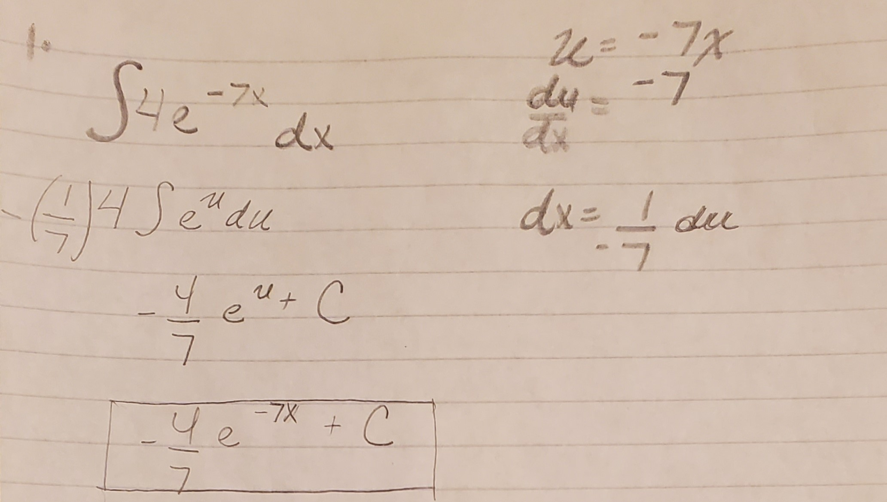
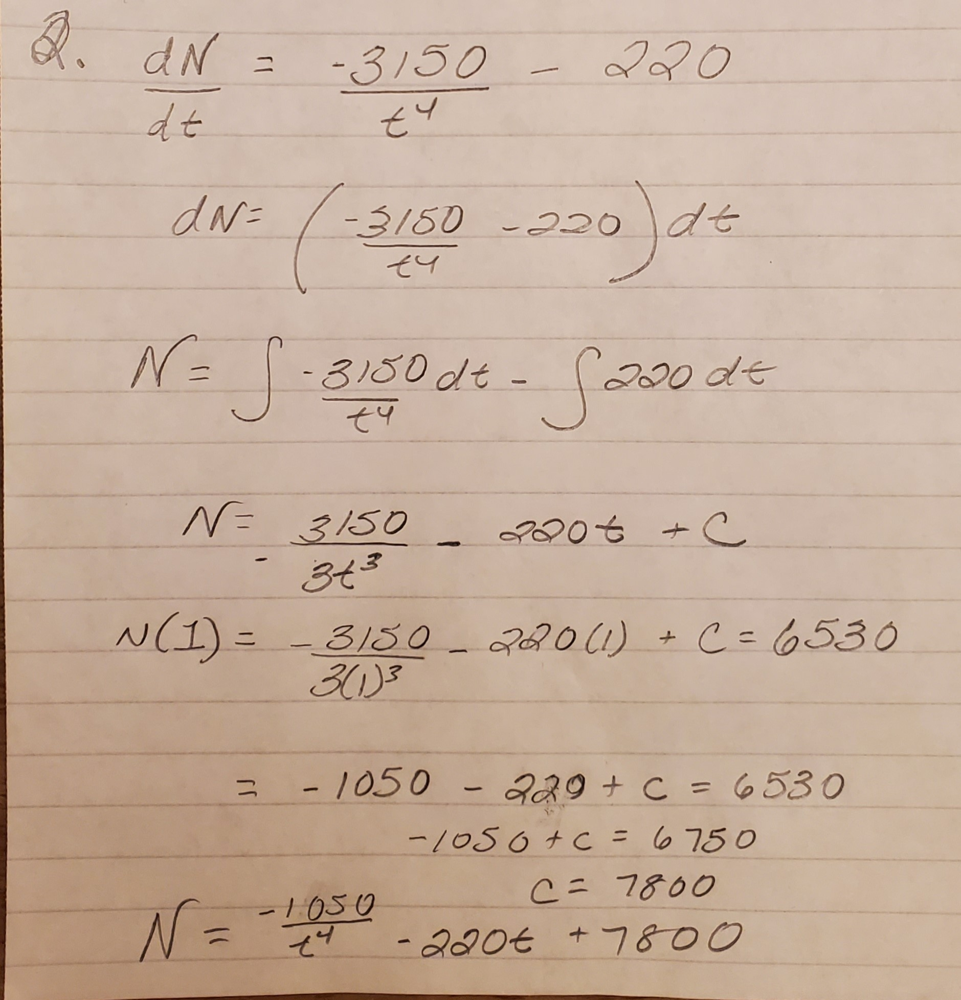
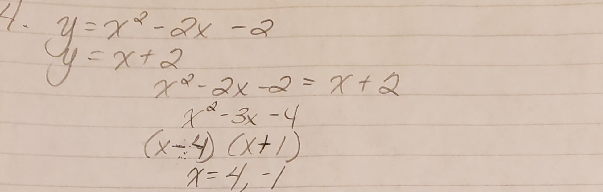
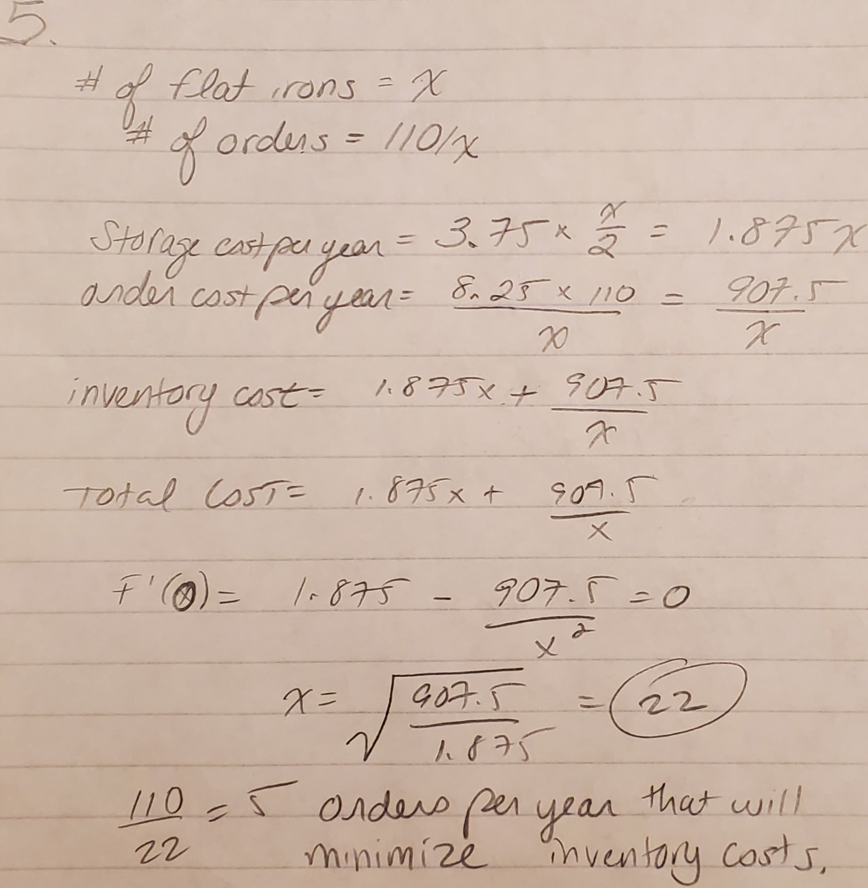
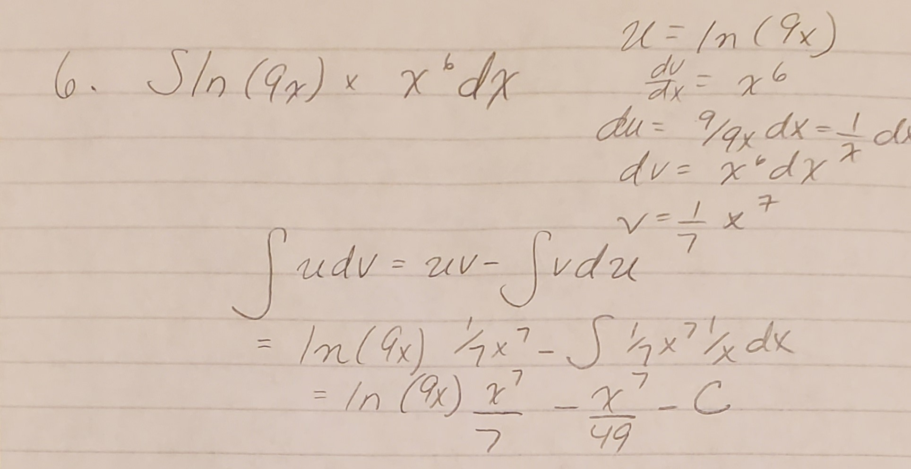
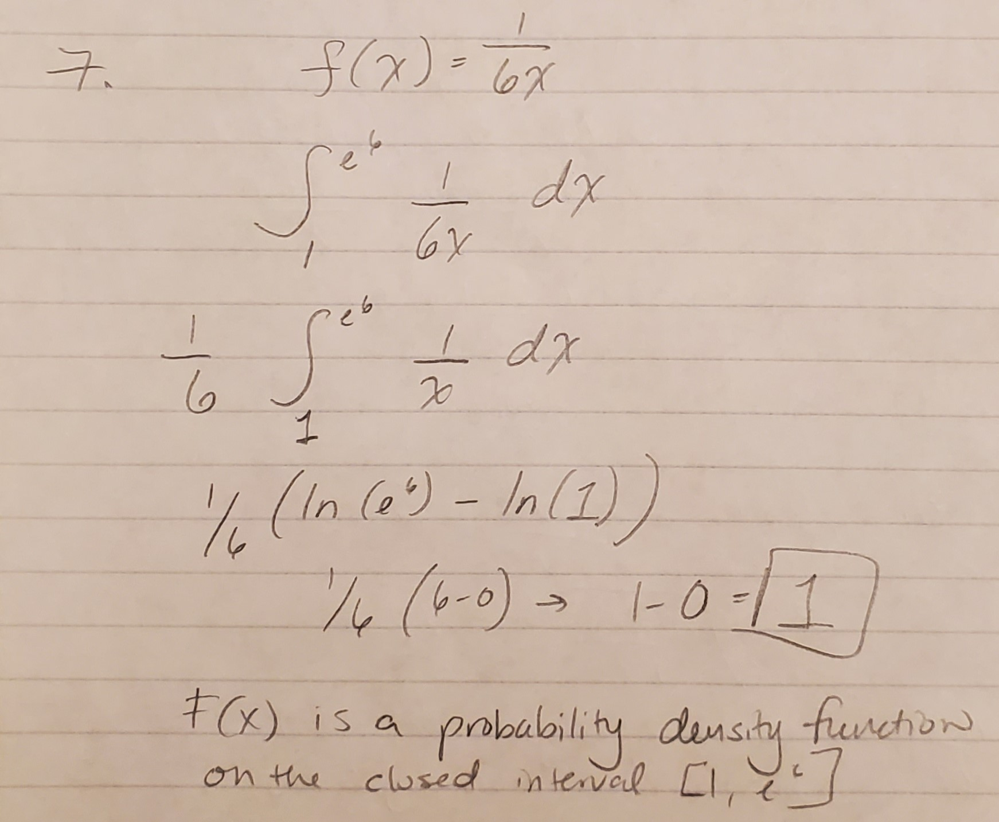

```{r setup, include=FALSE}
knitr::opts_chunk$set(echo = TRUE)
```

## Assignment 13

1.Use integration by substitution to solve the integral below

```{r}

```

2.Biologists are treating a pond contaminated with bacteria. The level of contamination is changing at a rate of
dN
dt =  3150
t 4  220 bacteria per cubic centimeter per day, where t is the number of days since treatment began. Find a
function N( t ) to estimate the level of contamination if the level after 1 day was 6530 bacteria per cubic centimeter.
```{r}

```
3.

Find the total area of the red rectangles in the figure below, where the equation of the line is f ( x ) = 2x - 9.
```{r}
prob_func<- function(x){
    2*x-9
}
area <- integrate(prob_func, lower = 4.5, upper=8.5)
area
```

4.
Find the area of the region bounded by the graphs of the given equations.
y = x2 - 2x - 2, y = x + 2
Finding the zeroes:
```{r}

```


```{r}
integrate_4 <- function(x) { x + 2 - (x**2 - 2*x - 2)}

area <- integrate(integrate_4, -1, 4)

area

```
5.

A beauty supply store expects to sell 110 flat irons during the next year. It costs $3.75 to store one flat iron for one year.
There is a fixed cost of $8.25 for each order. Find the lot size and the number of orders per year that will minimize
inventory costs.

```{r}

```

6.Use integration by parts to solve the integral below.

ln( 9x ) · x 6 dx
```{r}

```

7.Determine whether f ( x ) is a probability density function on the interval 1, e 6 . If not, determine the value of the
definite integral.
f ( x ) = 1/6x

```{r}

```