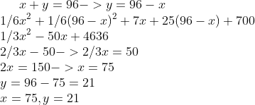

```{r setup, include=FALSE}
library(pracma)
knitr::opts_chunk$set(echo = TRUE)
```

## Data 605 HW #15

1. Find the equation of the regression line for the given points. Round any final values to the nearest hundredth, if necessary.
( 5.6, 8.8 ), ( 6.3, 12.4 ), ( 7, 14.8 ), ( 7.7, 18.2 ), ( 8.4, 20.8 )

```{r}
pt1 <- c(5.6, 6.3, 7, 7.7, 8.4)
pt2 <- c(8.8, 12.4, 14.8, 18.2, 20.8)

reg <- lm(pt2 ~ pt1)
summary(reg)
```
y = -14.8 + 4.2571x

2. Find all local maxima, local minima, and saddle points for the function given below. Write your answer(s) in the form
( x, y, z ). Separate multiple points with a comma

```{r}

```

3. A grocery store sells two brands of a product, the "house" brand and a "name" brand. The manager estimates that if she
sells the "house" brand for x dollars and the "name" brand for y dollars, she will be able to sell 81  21x + 17y units of the
"house" brand and 40 + 11x  23y units of the "name" brand.

Step 1. Find the revenue function R ( x, y ).
```{r}
revenue_func <- function(x, y){
  x*(81 - (21*x) + (17*y)) + y * (40 + (11 * x) - 23*y)
}
    
```
Step 2. What is the revenue if she sells the "house" brand for $2.30 and the "name" brand for $4.10?
```{r}
revenue_func(2.3, 4.1)
```

4. A company has a plant in Los Angeles and a plant in Denver. The firm is committed to produce a total of 96 units of a
product each week. The total weekly cost is given by C(x, y) = 1/6x^2 + 1/6 y^2 + 7x + 25y + 700, where x is the number of units produced in Los Angeles and y is the number of units produced in Denver. How many units should be produced in each plant to minimize the total weekly cost?

```{r}

```

5. Evaluate the double integral on the given region. Write your answer in exact form without decimals.
```{r}

```

```{r}
double_integral <- function(x,y) exp(8*x + 3 * y)

format(round(quad2d(double_integral, 2, 4, 2, 4), 17), scientific =  FALSE)

```
