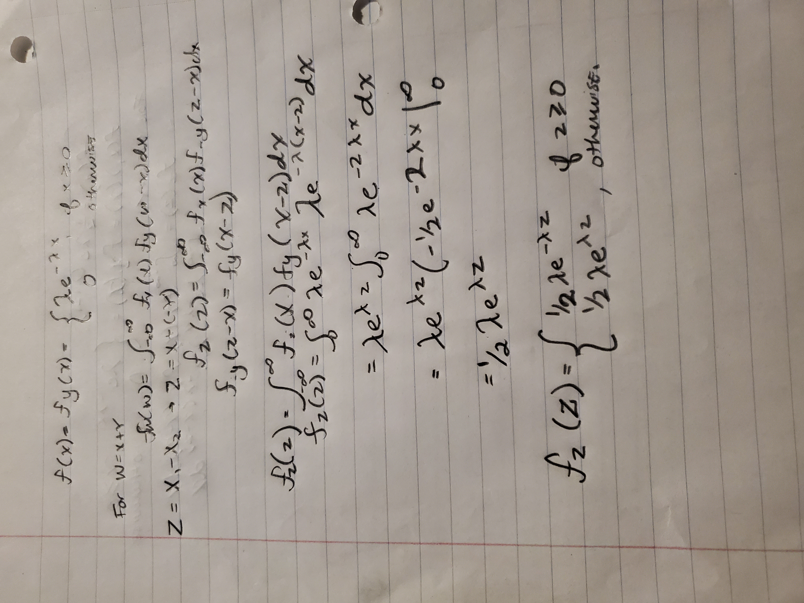

```{r setup, include=FALSE}
knitr::opts_chunk$set(echo = TRUE)
```

## Assignment #8

11. A company buys 100 lightbulbs, each of which has an exponential lifetime of
1000 hours. What is the expected time for the first of these bulbs to burn
out? (See Exercise 10.)

```{r}
expected_time = 1000/100
expected_time
```
14. Assume that X1 and X2 are independent random variables, each having an exponential density with parameter λ. Show that Z = X1-X2 has density

fZ(z) = (1/2)λe−λ|z|

```{r}

```

Exercise 1 Page 320
Let X be a continuous random variable with mean µ = 10 and variance
σ2 = 100/3. Using Chebyshev’s Inequality, find an upper bound for the
following probabilities.

(a) P(|X − 10| ≥ 2).
```{r}
v_x <- 100/3
sigma <- sqrt(v_x)

k <- 2/sigma
1/(k^2)

```

(b) P(|X − 10| ≥ 5).
```{r}
k <- 5/sigma
1/(k^2)
```

(c) P(|X − 10| ≥ 9).
```{r}
k <- 9/sigma
1/(k^2)
```

(d) P(|X − 10| ≥ 20).
```{r}
k <- 20/sigma
1/(k^2)
```


