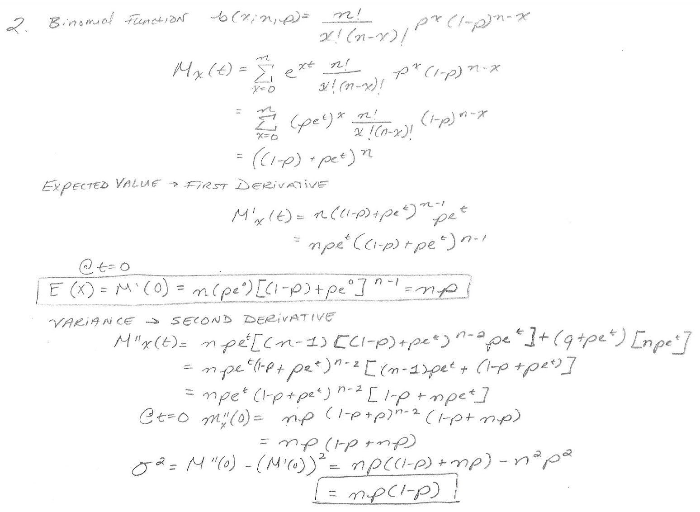
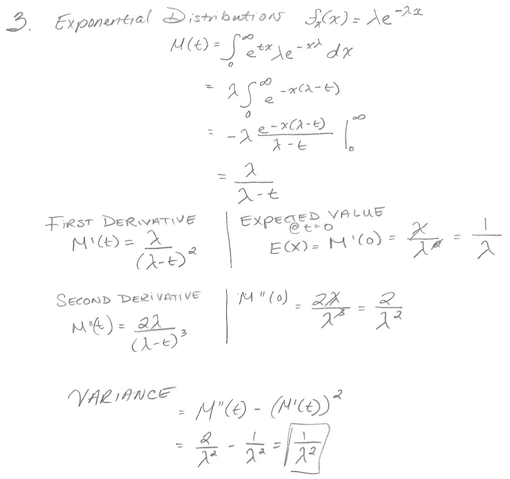

```{r setup, include=FALSE}
knitr::opts_chunk$set(echo = TRUE)
```

## Assignment # 9

The price of one share of stock in the Pilsdorff Beer Company (see Exercise 8.2.12) is given by Yn on the nth day of the year. Finn observes that
the differences Xn = Yn+1 − Yn appear to be independent random variables with a common distribution having mean µ = 0 and variance σ2 = 1/4. If Y1 = 100, estimate the probability that Y365 is

```{r}
mean <- 0
var <- (1/4)
std <- sqrt(var * 365)
```

(a) ≥ 100
```{r}
pnorm((100-100), mean = mean, sd = std, lower.tail = FALSE)
```

(b) ≥ 110
```{r}
pnorm((110-100), mean = mean, sd = std, lower.tail = FALSE)
```

(c) ≥ 120
```{r}
pnorm((120-100), mean = mean, sd = std, lower.tail = FALSE)
```

2.
Calculate the expected value and variance of the binomial distribution using the moment generating function.

```{r}

```

3.
Calculate the expected value and variance of the exponential distribution using the moment generating function.
```{r}

```